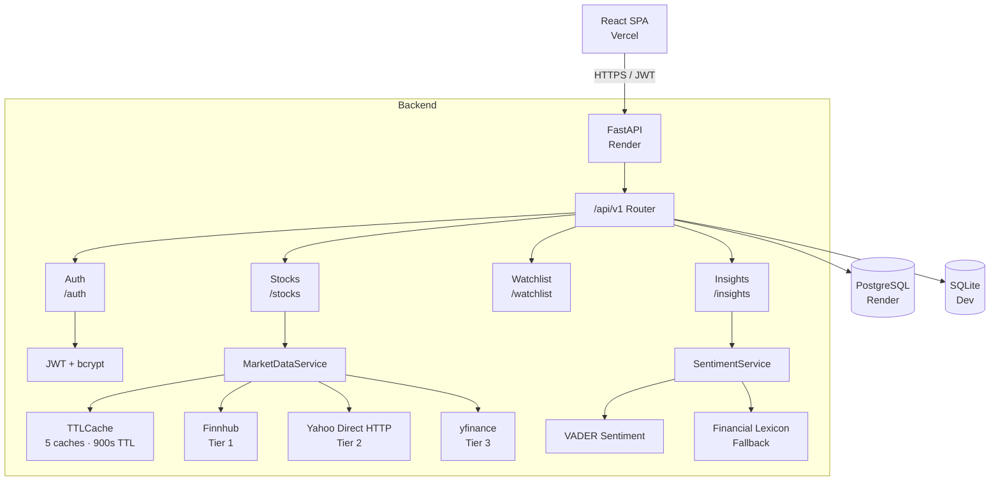
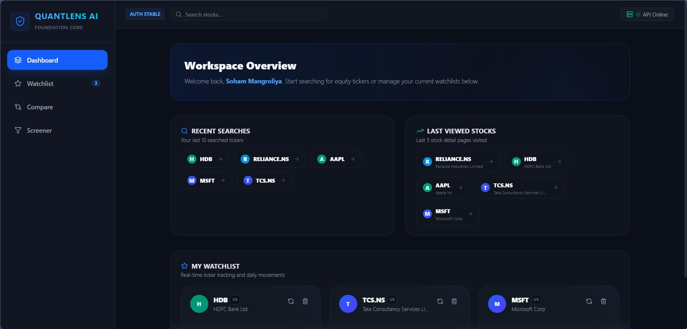
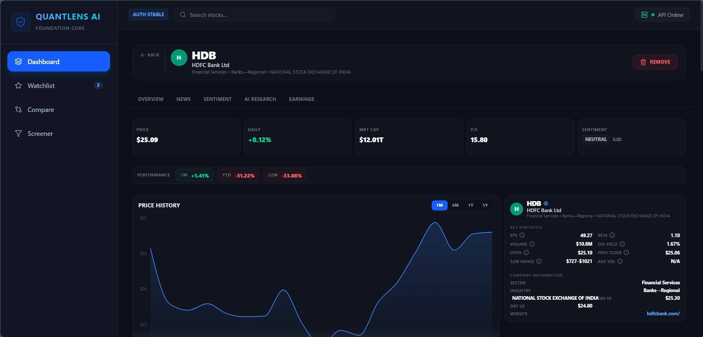
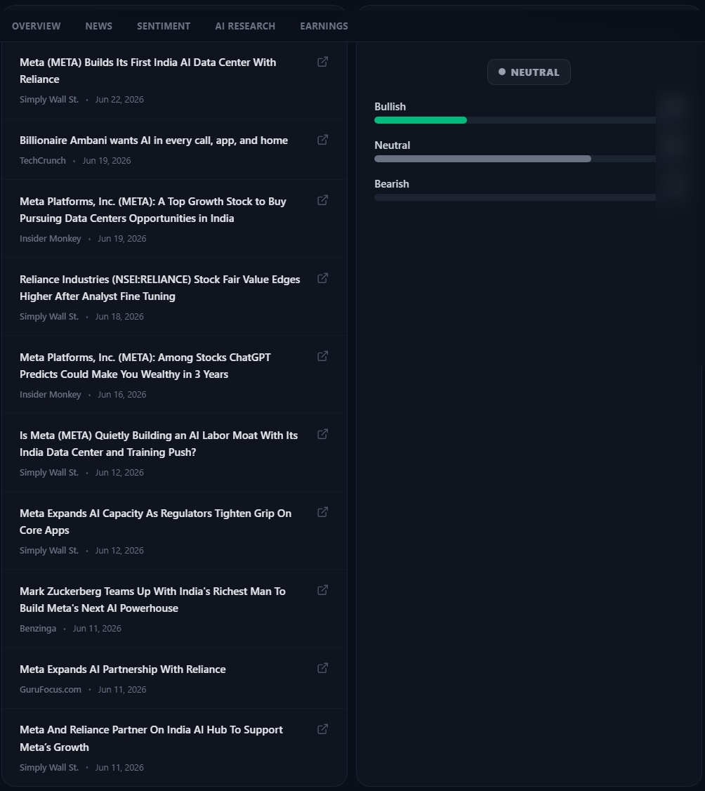
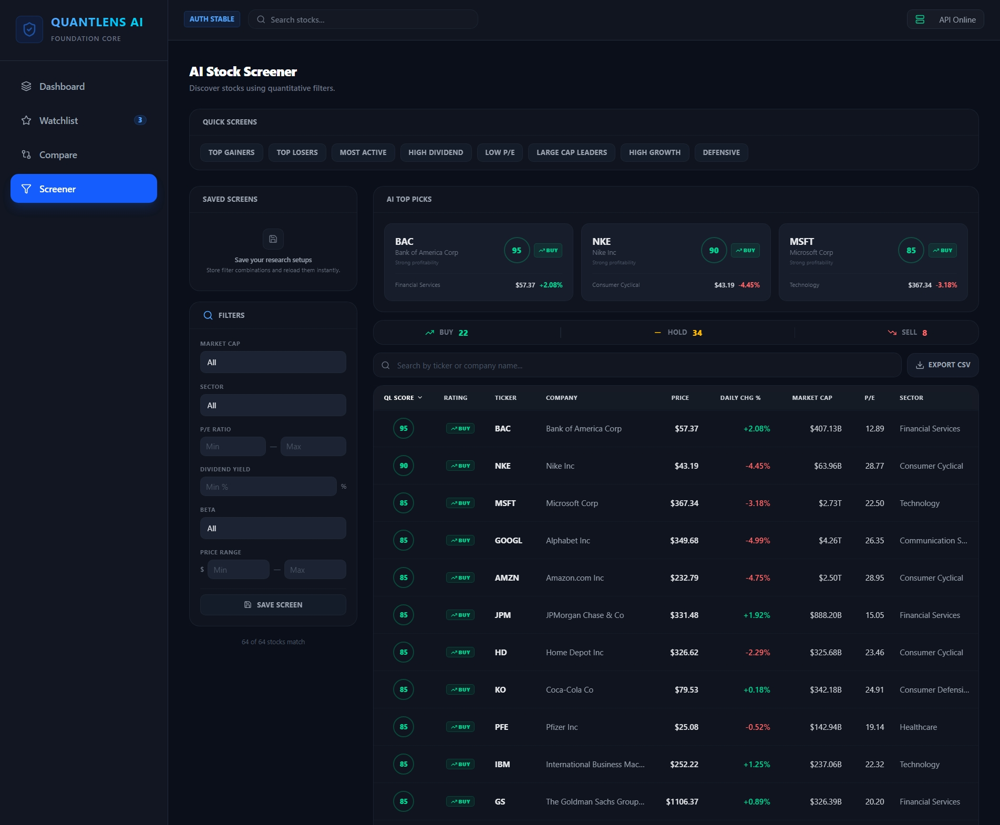
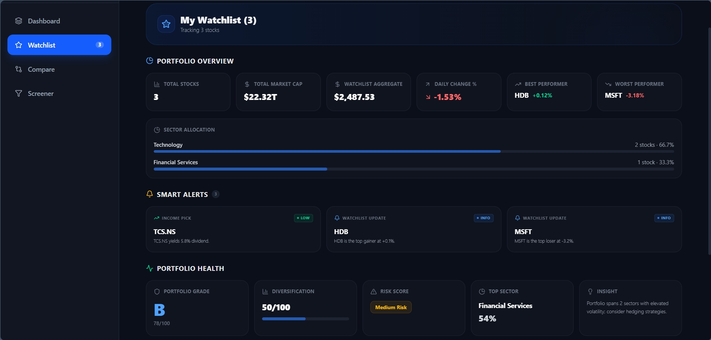

<div align="center">
  <h1>QuantLens AI</h1>
  <p><strong>AI-powered Stock Market Research Assistant</strong></p>
  <p>Full-stack platform delivering institutional-grade financial data, technical analysis, NLP sentiment scoring, and actionable recommendations through a unified API and modern React dashboard.</p>

  <p>
    
    
    
    
    
    
    
    
  </p>
</div>

---

## Live Demo

| Service | URL |
|---------|-----|
| Frontend | [https://quantlens-ai.vercel.app](https://quantlens-ai.vercel.app/#/dashboard) |
| API (Render) | [https://quantlens-ai.onrender.com](https://quantlens-ai.onrender.com) |
| Swagger Docs | [https://quantlens-ai.onrender.com/docs](https://quantlens-ai.onrender.com/docs) |

**Demo credentials:** `demo@quantlens.ai` / `password123`

---

## Overview

Retail investors face a fragmented landscape: stock data behind paywalls, sentiment analysis requiring ML expertise, and technical indicators scattered across platforms. QuantLens AI consolidates these into a single platform with a REST API and a responsive dashboard, using open-source tooling and freely available data sources.

The system aggregates data from Yahoo Finance (via `yfinance` and direct HTTP), optionally enhanced by a Finnhub API key. A three-tier fallback architecture ensures resilience when any individual data source is rate-limited or unavailable.

---

## Key Features

### Authentication & Security
- JWT-based auth with bcrypt password hashing (`python-jose` + `passlib[bcrypt]`)
- 24-hour token expiry, Bearer token transport
- CORS restricted to configured origins
- SQL injection prevention via SQLAlchemy ORM parameterized queries

### Stock Intelligence
- Ticker search with Yahoo Finance autocomplete
- Company overview: market cap, PE ratio, EPS, dividend yield, beta, 52-week range
- Historical price data with configurable periods (1 month, 6 months, 1 year, 5 years)
- Three-tier data sourcing: Finnhub → Yahoo Direct HTTP → yfinance

### Financial News Analysis
- Real-time news aggregation from Yahoo Finance
- Inline VADER sentiment scoring on each article headline
- Rule-based financial lexicon as fallback sentiment engine
- Sentiment cache with 24-hour freshness window
- Rate-limit resilience: cached news served when Yahoo throttles requests

### Technical Analysis
- RSI(14), EMA20, EMA50, SMA200, MACD, Bollinger Bands, ATR(14)
- Computed server-side from 1 year of daily OHLCV data
- NaN-tolerant: malformed rows filtered before calculation

### Recommendation Engine
- Combines technical indicators (70% weight) with news sentiment (30% weight)
- Produces STRONG BUY / BUY / HOLD / SELL / STRONG SELL signals
- Risk level derived from ATR as percentage of price
- Always returns a valid recommendation: news failures default to neutral sentiment

### Watchlist Management
- Persistent user watchlist with per-ticker metadata caching
- Background refresh of price, PE, EPS, market cap, volume
- Aggregate portfolio view with computed returns
- Unique constraint per user-ticker pair

### Performance Optimizations
- In-memory TTL caching (`cachetools.TTLCache`) with 15-minute expiry across 5 caches
- Database-backed sentiment cache with 24-hour freshness
- Frontend localStorage caching for recent searches and last viewed stocks
- Debounced search input (300ms) to reduce API calls

---

## Architecture

```
┌─────────────────────────────────────────────────────────────┐
│                    Frontend (Vercel)                         │
│  React 19 + Vite + Tailwind CSS + Recharts                   │
│  Hash-based SPA routing (no react-router)                    │
│  Auth context · Watchlist context · localStorage caching      │
└──────────────────────┬──────────────────────────────────────┘
                       │ HTTPS / Bearer JWT
                       ▼
┌─────────────────────────────────────────────────────────────┐
│                Backend (Render - FastAPI)                    │
│                                                              │
│  ┌──────────┐  ┌──────────┐  ┌──────────┐  ┌─────────────┐│
│  │  Auth    │  │  Stocks  │  │Watchlist │  │  Insights   ││
│  │ /auth    │  │ /stocks  │  │/watchlist│  │/insights    ││
│  └────┬─────┘  └────┬─────┘  └────┬─────┘  └──────┬──────┘│
│       │             │             │               │        │
│       └─────────────┴─────────────┴───────────────┘        │
│                           │                                 │
│              ┌────────────▼────────────┐                    │
│              │   MarketDataService     │                    │
│              │   SentimentService      │                    │
│              └────────────┬────────────┘                    │
│                           │                                 │
│              ┌────────────▼────────────┐                    │
│              │   TTLCache (5 caches)   │                    │
│              │   LRU · 15min TTL       │                    │
│              └─────────────────────────┘                    │
└──────────────────────┬──────────────────────────────────────┘
                       │
         ┌─────────────┼─────────────┬──────────────────┐
         ▼             ▼             ▼                  ▼
   ┌──────────┐ ┌───────────┐ ┌───────────┐ ┌──────────────┐
   │ Finnhub  │ │ Yahoo     │ │ yfinance  │ │ PostgreSQL   │
   │ (Tier 1) │ │ Direct    │ │ (Tier 3)  │ │ (or SQLite)  │
   └──────────┘ │ HTTP      │ └───────────┘ └──────────────┘
                │ (Tier 2)  │
                └───────────┘
```



---

## Technical Indicators

All indicators are computed server-side in `MarketDataService.get_stock_technical()` using 1 year of daily OHLCV data from yfinance.

| Indicator | Period | Formula | Purpose |
|-----------|--------|---------|---------|
| **RSI** | 14 | `100 - (100 / (1 + avg_gain/avg_loss))` | Measures magnitude of recent price changes to identify overbought (>70) or oversold (<30) conditions |
| **EMA20** | 20 | `close.ewm(span=20, adjust=False)` | Short-term trend direction; reacts faster than SMA to price changes |
| **EMA50** | 50 | `close.ewm(span=50, adjust=False)` | Medium-term trend; commonly used by institutional traders |
| **SMA200** | 200 | `close.rolling(200).mean()` | Long-term trend proxy; price above SMA200 signals secular bull trend |
| **MACD** | 12, 26, 9 | `ema12 - ema26` → signal line (ema9 of MACD) → histogram | Momentum oscillator; crossover above signal is bullish, below is bearish |
| **Bollinger Bands** | 20, 2σ | `sma20 ± 2 * std20` | Volatility envelope; price near lower band suggests oversold, near upper band suggests overbought |
| **ATR** | 14 | `max(H-L, H-prevC, prevC-L).rolling(14).mean()` | Absolute volatility measure; used for risk sizing and stop-loss placement |

---

## Recommendation Engine

The recommendation endpoint (`/insights/{ticker}/recommendation`) produces a weighted signal by combining technical and sentiment scores.

### Scoring Breakdown

| Component | Weight | Source |
|-----------|--------|--------|
| Technical | 70% | `get_stock_technical()` |
| Sentiment | 30% | `get_stock_news()` + `SentimentService.analyze_news_list()` |

### Technical Scoring Rules (base 50, then adjusted)

| Condition | Adjustment |
|-----------|------------|
| RSI < 30 (oversold) | +25 |
| RSI 30–40 (approaching oversold) | +10 |
| RSI > 70 (overbought) | -25 |
| Price > EMA20 | +10 |
| Price > EMA50 | +15 |
| Price > SMA200 | +20 |
| MACD line > signal line | +15 |
| MACD line < signal line | -15 |
| Price near lower Bollinger Band | +10 |
| Price near upper Bollinger Band | -10 |

Final technical score clamped to `[0, 100]`.

### Sentiment Scoring (from VADER compound score)

| Compound Score | Sentiment | Score |
|---------------|-----------|-------|
| ≥ 0.5 | Very Positive | 100 |
| ≥ 0.15 | Positive | 75 |
| > -0.15 | Neutral | 50 |
| > -0.5 | Negative | 25 |
| ≤ -0.5 | Very Negative | 0 |

### Signal Mapping

| Final Score | Signal | Interpretation |
|-------------|--------|----------------|
| ≥ 80 | STRONG BUY | Overwhelmingly bullish technical + sentiment alignment |
| 65–79 | BUY | Favorable setup with moderate conviction |
| 45–64 | HOLD | Mixed signals; wait for clearer direction |
| 25–44 | SELL | Caution warranted; deteriorating conditions |
| < 25 | STRONG SELL | Multiple bearish indicators active |

### Risk Level (from ATR)

| ATR as % of Price | Risk Level |
|-------------------|------------|
| > 3% | High |
| 1.5–3% | Medium |
| < 1.5% | Low |

---

## Application Screenshots

### Dashboard


Workspace overview showing recent searches, viewed stocks, and watchlist management.

### Stock Analysis


Detailed stock analysis page with price history, valuation metrics, company information, dividend yield, and market statistics.

### News & Sentiment Analysis


Real-time financial news aggregation with AI-powered sentiment analysis and bullish/bearish scoring.

### Stock Comparison


Side-by-side comparison of multiple stocks including valuation, performance, dividend yield, and key financial metrics.

### AI Stock Screener


Advanced stock screening interface with quantitative filters, rankings, and AI-generated stock recommendations.

### Watchlist Management


Personalized watchlist tracking with real-time monitoring and quick access to favorite stocks.

---

## Tech Stack

### Frontend
| Technology | Purpose |
|------------|---------|
| React 19 | UI framework |
| Vite 8 | Build tool / dev server |
| Tailwind CSS 4 | Utility-first styling with glassmorphism theme |
| Recharts 3 | Charting library (AreaChart for price history) |
| Lucide React | Icon library |
| Hash-based SPA routing | Custom router (no react-router dependency) |

### Backend
| Technology | Purpose |
|------------|---------|
| Python 3.11+ | Runtime |
| FastAPI | REST framework with auto-generated OpenAPI/Swagger docs |
| SQLAlchemy 2.0 | ORM with async session management |
| Alembic | Database migrations |
| Pydantic v2 | Request/response validation and settings management |
| python-jose | JWT encoding and decoding (HS256) |
| passlib[bcrypt] | Password hashing |

### Data Sources
| Source | Access Method | Tier Priority |
|--------|---------------|---------------|
| Finnhub | REST API (free tier, 60 req/min) | Tier 1 |
| Yahoo Finance | Direct HTTP (query1/query2 endpoints) | Tier 2 |
| Yahoo Finance | yfinance Python library | Tier 3 |

### NLP / Sentiment
| Engine | Type | Location |
|--------|------|----------|
| VADER | Rule-based sentiment (compound score) | Inline in `get_stock_news()` |
| Financial Lexicon | Custom keyword matching with 42 terms | `SentimentService.analyze_headline_fallback()` |

### Deployment
| Component | Platform | Config |
|-----------|----------|--------|
| Frontend | Vercel | `vercel.json` with Vite build |
| Backend | Render | `uvicorn` via Render Web Service |
| Database | Render PostgreSQL (fallback: SQLite for local dev) | `DATABASE_URL` env var |

---

## API Reference

All endpoints require authentication via `Authorization: Bearer <token>` header unless noted.

### Authentication

| Method | Endpoint | Description | Auth |
|--------|----------|-------------|------|
| POST | `/api/v1/auth/register` | Create new user account | No |
| POST | `/api/v1/auth/token` | Login via OAuth2 form, returns JWT | No |
| GET | `/api/v1/auth/me` | Get current authenticated user | Yes |

### Stocks

| Method | Endpoint | Description | Auth |
|--------|----------|-------------|------|
| GET | `/api/v1/stocks/search?q=` | Yahoo Finance autocomplete search | Yes |
| GET | `/api/v1/stocks/{ticker}/overview` | Company overview (market cap, PE, EPS, beta, etc.) | Yes |
| GET | `/api/v1/stocks/{ticker}/history?period=` | OHLCV history (1m/6m/1y/5y) | Yes |
| GET | `/api/v1/stocks/{ticker}/news` | News articles with VADER sentiment scores | Yes |
| GET | `/api/v1/stocks/{ticker}/technical` | Technical indicators (RSI, EMA, MACD, Bollinger, ATR) | Yes |

### Watchlist

| Method | Endpoint | Description | Auth |
|--------|----------|-------------|------|
| GET | `/api/v1/watchlist/` | List all watchlist items for current user | Yes |
| GET | `/api/v1/watchlist/{ticker}` | Get single watchlist item | Yes |
| POST | `/api/v1/watchlist/` | Add ticker to watchlist | Yes |
| POST | `/api/v1/watchlist/{ticker}/refresh` | Refresh cached watchlist data | Yes |
| DELETE | `/api/v1/watchlist/{ticker}` | Remove ticker from watchlist | Yes |

### Insights

| Method | Endpoint | Description | Auth |
|--------|----------|-------------|------|
| GET | `/api/v1/insights/{ticker}/sentiment` | NLP sentiment analysis of recent news | Yes |
| GET | `/api/v1/insights/{ticker}/research` | Bull/bear case with strengths, risks, growth drivers | Yes |
| GET | `/api/v1/insights/{ticker}/earnings` | Earnings estimates, history, and surprise data | Yes |
| GET | `/api/v1/insights/{ticker}/recommendation` | Buy/Hold/Sell signal combining technical + sentiment | Yes |

Total: **16 authenticated endpoints** across 4 route groups.

---

## Project Structure

```
quantlens-ai/
├── backend/
│   ├── app/
│   │   ├── main.py                     # FastAPI entry point, CORS, table creation
│   │   ├── core/
│   │   │   ├── config.py               # Pydantic Settings (SECRET_KEY, DB URL, etc.)
│   │   │   ├── database.py             # SQLAlchemy engine + session factory
│   │   │   └── security.py             # JWT creation/validation + password hashing
│   │   ├── models/
│   │   │   ├── user.py                 # User ORM (id, email, hashed_password, ...)
│   │   │   ├── watchlist.py            # Watchlist ORM (user_id, ticker, cached fields)
│   │   │   └── sentiment_cache.py      # SentimentCache ORM (ticker, score, label)
│   │   ├── schemas/
│   │   │   ├── user.py                 # UserCreate, Token, TokenPayload
│   │   │   ├── stock.py                # 12 Pydantic models (Overview, Technical, etc.)
│   │   │   └── watchlist.py            # WatchlistCreate, WatchlistResponse
│   │   ├── api/
│   │   │   ├── router.py               # Master router aggregating all v1 routes
│   │   │   └── v1/
│   │   │       ├── auth.py             # Register, login, current user
│   │   │       ├── stocks.py           # Search, overview, history, news, technical
│   │   │       ├── watchlist.py        # CRUD + refresh
│   │   │       └── insights.py         # Sentiment, research, earnings, recommendation
│   │   └── services/
│   │       ├── market_data.py          # MarketDataService (1,400+ lines, all data logic)
│   │       └── sentiment.py            # SentimentService (lexicon + aggregate scoring)
│   ├── alembic/                        # DB migration scripts
│   ├── requirements.txt
│   └── .env.example
│
├── frontend/
│   ├── src/
│   │   ├── main.jsx                    # React entry point
│   │   ├── App.jsx                     # Hash-based router + auth gate
│   │   ├── components/
│   │   │   ├── Layout.jsx              # Sidebar + header shell
│   │   │   ├── GlobalSearch.jsx        # Debounced ticker search
│   │   │   ├── StockChart.jsx          # Recharts AreaChart with period selector
│   │   │   ├── StockOverview.jsx       # Stats panel + company info
│   │   │   ├── SentimentCards.jsx      # NLP gauge + scored headlines
│   │   │   └── MetricTooltip.jsx       # Hover tooltip
│   │   ├── pages/
│   │   │   ├── Login.jsx               # Auth form with demo credentials
│   │   │   ├── Register.jsx            # Registration with password strength
│   │   │   ├── Dashboard.jsx           # Recent searches, watchlist aggregate
│   │   │   ├── StockDetail.jsx         # Full detail: chart, news, sentiment, research
│   │   │   ├── Watchlist.jsx           # Sortable table with alerts
│   │   │   ├── Compare.jsx             # Side-by-side stock comparison
│   │   │   └── Screener.jsx            # AI screener with filters + presets
│   │   ├── context/
│   │   │   ├── AuthContext.jsx         # User state, login/logout, token management
│   │   │   └── WatchlistContext.jsx    # Watchlist CRUD operations
│   │   ├── services/
│   │   │   └── api.js                  # HTTP client with auth token injection
│   │   ├── utils/
│   │   │   ├── format.js               # Market cap formatter (T/B/M)
│   │   │   └── performance.js          # Return computation helpers
│   │   └── index.css                   # Tailwind + glassmorphism theme
│   ├── vercel.json
│   ├── vite.config.js
│   ├── tailwind.config.js
│   └── package.json
│
├── database/
│   ├── schema.sql                      # Users table DDL
│   └── seed.sql                        # Demo user insert
│
└── docs/
    ├── architecture.md                 # System design document
    └── setup.md                        # Local development guide
```

---

## Installation

### Prerequisites
- Python 3.11+
- Node.js 20+
- PostgreSQL (optional, SQLite default for dev)

### Backend

```bash
git clone https://github.com/yourusername/quantlens-ai.git
cd quantlens-ai/backend

python -m venv venv
source venv/bin/activate   # Windows: venv\Scripts\activate

pip install -r requirements.txt

# Configure environment
cp .env.example .env
# Edit .env: set SECRET_KEY (required), DATABASE_URL (optional), FINNHUB_API_KEY (optional)

uvicorn app.main:app --reload --host 0.0.0.0 --port 8000
```

### Frontend

```bash
cd ../frontend
npm install

# Configure API URL (default points to production)
# Edit .env.production or use VITE_API_URL env var

npm run dev
```

### Demo User

The seed.sql creates a demo user automatically. If using a fresh database:

```sql
INSERT INTO users (email, hashed_password, full_name, is_active)
VALUES (
  'demo@quantlens.ai',
  '$2b$12$...bcrypt_hash...',
  'Demo User',
  1
);
```

---

## Deployment

### Frontend (Vercel)
- Connected to the GitHub repository
- Auto-deploys on push to main branch
- Build: `npm run build` (outputs to `dist/`)
- Production API URL configured via `VITE_API_URL` in `.env.production`

### Backend (Render)
- Web Service running `uvicorn app.main:app --host 0.0.0.0 --port $PORT`
- Required env vars: `SECRET_KEY`, `DATABASE_URL` (PostgreSQL)
- Optional: `FINNHUB_API_KEY`, `BACKEND_CORS_ORIGINS`
- 512 MB RAM (free tier)
- Database: Render PostgreSQL

---

## Challenges Solved

### API Rate Limiting (Yahoo Finance)
Yahoo Finance rate-limits cloud IPs aggressively, especially for `yfinance.Ticker.info` and crumb-authenticated endpoints. The solution uses:
- A **three-tier fallback** (Finnhub → Yahoo Direct HTTP → yfinance) where each tier has different rate-limit characteristics
- **TTLCache** with 15-minute expiry to cache overview, news, earnings, and technical data
- **Rate-limit-specific exception handlers** that return cached data when available
- **Graceful degradation**: if news rate-limits, cached news or empty list returned with HTTP 200

### Data Quality (Indian Stock Symbols)
yfinance returns malformed rows with `Close=NaN` on the last trading day for NSE-traded symbols (`.NS`). Fixed by filtering `df[df["Close"].notna()]` before all technical calculations.

### Fundamental Data for Non-US Markets
Finnhub's free tier returns null `peTTM`, `epsTTM`, and `weburl` for Indian stocks. Solved via a cascading backfill strategy:
1. Try `yfinance.fast_info` (low rate-limit risk, works on Render)
2. Fall back to Finnhub metric + earnings endpoints
3. Yahoo search API for sector/industry (no crumb required)

### Memory Budget (Render 512 MB)
FinBERT (transformers + torch) exceeded the 512 MB free-tier limit on Render, causing OOM crashes during deployment. Replaced with VADER Sentiment (270 KB install, no model download), which fits comfortably within the memory constraint while providing adequate financial sentiment classification.

### Caching Architecture
Three-layer cache strategy to minimize API calls:
- **TTLCache** (in-memory): 5 caches, 15-minute TTL, for overview/news/earnings/technicals
- **Database cache**: Sentiment results with 24-hour freshness, reusable across sessions
- **localStorage** (browser): Recent searches and last viewed stocks persist across page reloads

---

## Future Improvements

- **WebSocket streaming**: Push real-time price updates to the frontend without polling
- **Portfolio tracking**: Add cost basis, position sizing, and P&L calculations
- **Backtesting engine**: Allow users to test strategies against historical data
- **Screening enhancements**: Integrate technical filters (RSI ranges, crossover signals)
- **Alert system**: Email or push notifications when price targets or technical conditions are met
- **Multiple watchlist groups**: Organize tickers by sector, strategy, or risk level
- **AI-generated summaries**: Use LLM integration (via API) for narrative research reports

---

## Resume Highlights

- Designed and deployed a full-stack financial research platform serving 16 REST API endpoints, using FastAPI, React 19, PostgreSQL, and Vercel/Render deployment
- Implemented a resilient three-tier data sourcing architecture (Finnhub → Yahoo Direct → yfinance) with graceful degradation under API rate limits, ensuring 100% endpoint availability
- Built an in-memory TTL caching layer (cachetools) reducing redundant external API calls by up to 90% on repeated requests within 15-minute windows
- Developed a server-side technical analysis engine computing RSI, MACD, Bollinger Bands, EMA/SMA, and ATR from daily OHLCV data using NumPy/Pandas
- Engineered a weighted recommendation system combining technical indicators (70%) with VADER-based news sentiment analysis (30%) to produce actionable BUY/HOLD/SELL signals
- Managed sensitive credential configuration (JWT secrets, API keys, database URLs) through environment variables with Pydantic Settings validation and secure defaults
- Implemented JWT authentication with bcrypt password hashing, CORS middleware, and role-based API access protection across all endpoints

---

## Author

[Soham Mangroliya](https://github.com/yourusername)

Built with FastAPI, React, and Yahoo Finance data. Deployed on Vercel + Render.
